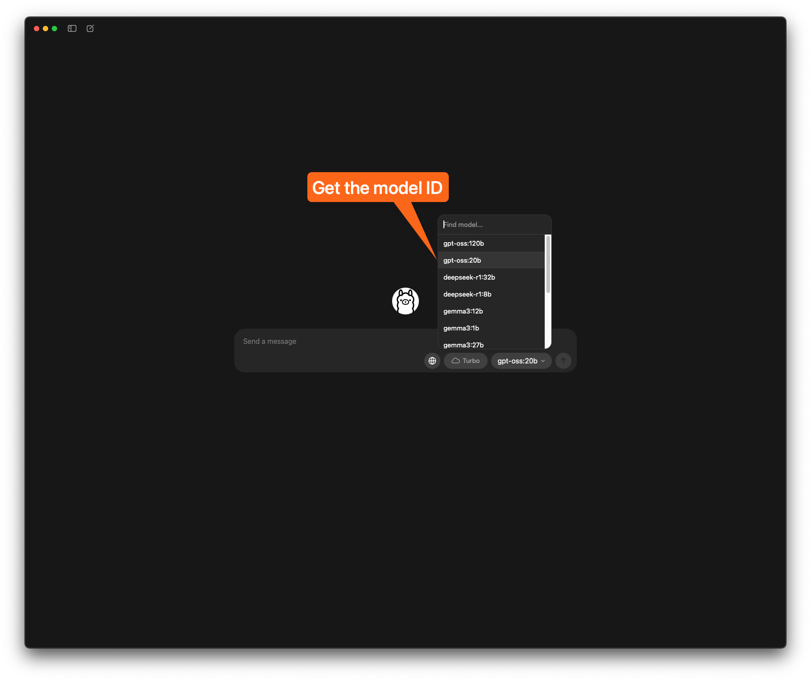
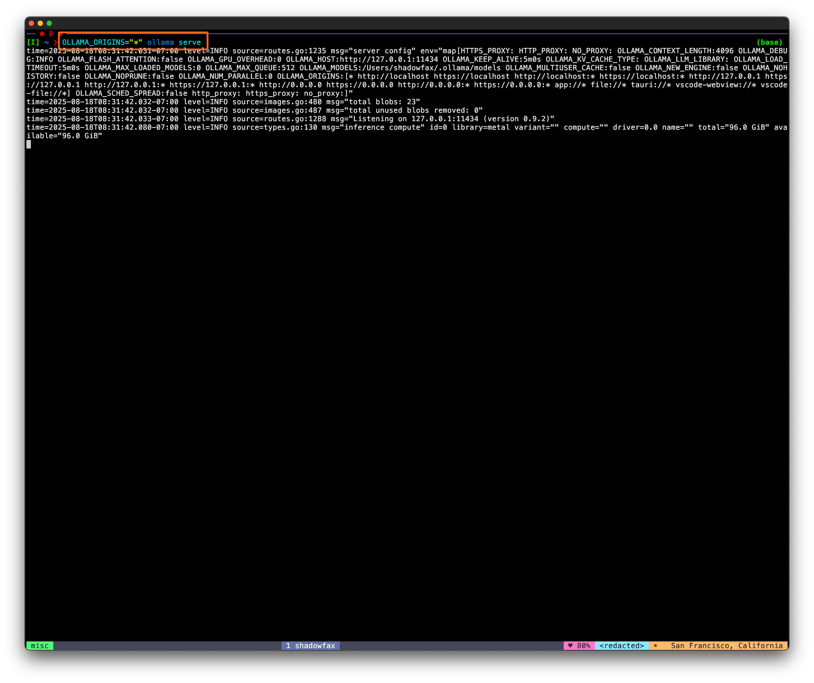
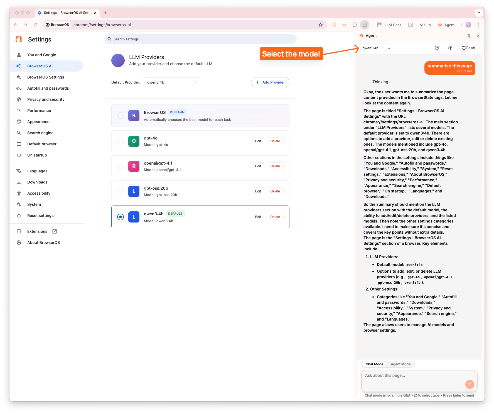

# Setting-up Ollama with BrowserOS

## Steps

1. Navigate to `chrome://settings/browseros-ai` to add Ollama as a provider.
2. Get the model ID of ollama model i.e. `gpt-oss:20b`
3. You need to start ollama with this command to prevent CORS issue `OLLAMA_ORIGINS="*" ollama serve`
    - 💥 If you don’t want to run from CLI, we recommend using LM studio. See the guide here - [Setting-up LM Studio with BrowserOS](../documentations/setting-up-lm-studio.md)
4. Select the model in agent and start using it! 🥳

## Visual Steps

### **Step 1: Navigate to settings page `chrome://settings/browseros-ai`**

### **Step 2: Get the ollama model ID**

### **Step 3: Start Ollama from CLI**

`OLLAMA_ORIGINS="*" ollama serve` 

Unfortunately, Ollama by default doesn’t allow requests from other apps without this.

💥 If you don’t want to run from CLI, we recommend using LM studio. See the guide here - [Setting-up LM Studio with BrowserOS](../documentations/setting-up-lm-studio.md)

### Step 4: Use the model

Select the model in `Agent` drop-down and start using it 🚀

